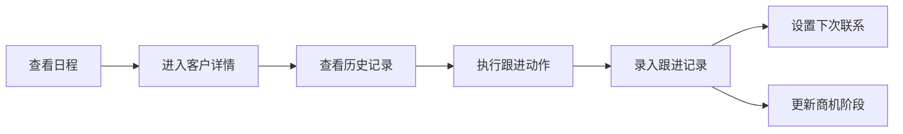
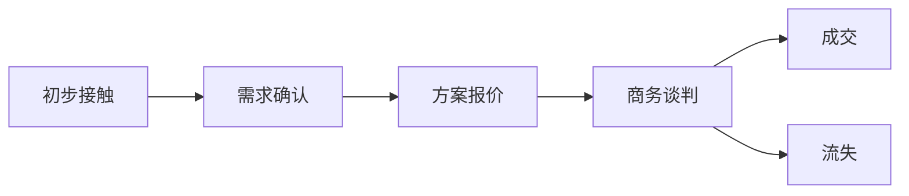
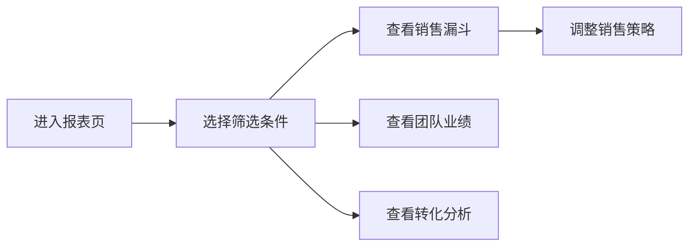

## 1. 产品概述

客户关系管理(CRM)Web应用，服务于小型销售团队跟进潜在客户，提升销售转化率和团队协作效率。

- 主要用途：管理客户信息、跟进记录、销售机会，提供销售漏斗统计分析
- 解决问题：解决销售团队客户信息分散、跟进不及时、商机流失、团队业绩不可视等问题
- 目标用户：销售人员和销售主管
- 市场价值：帮助小型销售团队系统化管理客户关系，提升销售效率和业绩

## 2. 核心功能

### 2.1 用户角色

| 角色 | 注册方式 | 核心权限 |
|------|----------|----------|
| 销售人员 | 系统分配 | 查看日程、管理客户、录入跟进记录、管理销售机会 |
| 销售主管 | 系统分配 | 所有销售人员权限 + 查看统计报表、分配任务、团队业绩分析 |

### 2.2 功能模块

1. **客户列表页**：客户搜索、筛选、列表展示、新增客户
2. **客户详情页**：客户资料、联系人管理、跟进记录、附件管理
3. **跟进日程页**：待跟进客户列表、日历视图、任务提醒
4. **销售机会页**：商机列表、阶段看板、报价管理、成交概率
5. **统计报表页**：销售漏斗、转化分析、团队业绩、客户来源统计

### 2.3 页面详情

| 页面名称 | 模块名称 | 功能描述 |
|----------|----------|----------|
| 客户列表页 | 搜索筛选 | 按客户名称、等级、来源、负责人搜索筛选 |
| 客户列表页 | 客户列表 | 卡片式展示客户基本信息、等级标签、最新跟进时间 |
| 客户列表页 | 新增客户 | 表单录入客户名称、行业、规模、来源、等级、联系人等 |
| 客户详情页 | 基本信息 | 展示和编辑客户名称、行业、规模、地址、网站等 |
| 客户详情页 | 联系人管理 | 新增、编辑、删除联系人（姓名、职位、电话、邮箱） |
| 客户详情页 | 跟进记录 | 时间线展示跟进历史，新增通话/会议/邮件记录及备注 |
| 客户详情页 | 附件管理 | 上传和下载合同、报价单等相关文件 |
| 客户详情页 | 下次联系 | 设置下次联系提醒，关联跟进任务 |
| 跟进日程页 | 待办列表 | 按日期展示待跟进客户，标记完成状态 |
| 跟进日程页 | 日历视图 | 月视图展示跟进计划，点击查看详情 |
| 跟进日程页 | 任务分派 | 主管可将客户跟进任务分配给销售人员 |
| 销售机会页 | 商机看板 | 按阶段（初步接触→需求确认→方案报价→商务谈判→成交/流失）展示 |
| 销售机会页 | 商机卡片 | 展示商机名称、金额、成交概率、预计成交日期、负责人 |
| 销售机会页 | 阶段流转 | 拖拽或点击切换商机阶段，记录流转原因 |
| 销售机会页 | 报价记录 | 记录每次报价金额、时间、备注 |
| 统计报表页 | 销售漏斗 | 按阶段展示客户数量和转化率 |
| 统计报表页 | 转化分析 | 客户来源转化、行业分布、等级分布图表 |
| 统计报表页 | 团队业绩 | 按人员统计商机数量、成交金额、转化率排名 |
| 统计报表页 | 数据筛选 | 按时间范围、销售人员筛选统计数据 |

## 3. 核心流程

### 3.1 客户跟进流程

销售人员登录系统后，在日程页查看今日待跟进客户，点击客户进入详情页，查看历史跟进记录，进行本次跟进（电话/会议/邮件），录入跟进内容和结果，设置下次联系时间，如有商机则创建或更新销售机会，推进商机阶段。

### 3.2 商机流转流程

客户初步接触后创建商机，经过需求确认、方案报价、商务谈判等阶段，最终成交或流失。每个阶段可记录沟通内容、报价金额、成交概率等信息。

### 3.3 报表查看流程

销售主管进入统计报表页，选择时间范围和团队成员，查看销售漏斗、转化率、团队业绩排名等数据，根据分析结果调整销售策略和任务分配。

## 4. 用户界面设计

### 4.1 设计风格

- **主色调**：深邃蓝色（#1e3a5f）作为主色，体现专业和可信赖
- **辅助色**：翡翠绿（#10b981）表示成功/成交，琥珀色（#f59e0b）表示进行中，玫瑰红（#ef4444）表示流失/警告
- **中性色**：石板灰系列作为文本和背景色，确保良好的可读性
- **按钮风格**：圆角4px，悬停时背景色加深，轻微阴影提升层次感
- **字体**：标题使用"Noto Serif SC"衬线字体体现专业质感，正文使用"Inter"无衬线字体确保可读性
- **布局风格**：左侧导航栏 + 顶部操作栏 + 右侧内容区，卡片式布局展示数据
- **图标风格**：使用Lucide图标库，统一线性风格

### 4.2 页面设计概述

| 页面名称 | 模块名称 | UI元素 |
|----------|----------|--------|
| 客户列表页 | 搜索筛选 | 顶部搜索框，筛选下拉菜单，标签式筛选器 |
| 客户列表页 | 客户列表 | 网格布局卡片，头像、客户名称、等级标签、最新跟进时间、操作按钮 |
| 客户列表页 | 新增客户 | 右侧滑出表单，分步录入信息，表单验证 |
| 客户详情页 | 基本信息 | 分栏布局，左侧客户信息，右侧关键指标（商机数、成交金额） |
| 客户详情页 | 联系人管理 | 列表展示，悬浮编辑，头像首字母 |
| 客户详情页 | 跟进记录 | 时间线布局，类型图标区分，内容展开/收起 |
| 客户详情页 | 附件管理 | 文件图标网格，悬停显示操作按钮 |
| 跟进日程页 | 待办列表 | 左侧时间轴，右侧任务卡片，完成勾选动画 |
| 跟进日程页 | 日历视图 | 月历网格，标记有任务的日期，点击展开详情 |
| 跟进日程页 | 任务分派 | 下拉选择销售人员，确认对话框 |
| 销售机会页 | 商机看板 | 五列看板布局，卡片拖拽，阶段标题统计数量 |
| 销售机会页 | 商机卡片 | 渐变顶部边框表示阶段，金额突出显示，概率进度条 |
| 销售机会页 | 阶段流转 | 拖拽动画，流转原因弹窗 |
| 统计报表页 | 销售漏斗 | 倒三角形漏斗图，各阶段数量和转化率标注 |
| 统计报表页 | 转化分析 | 饼图展示来源分布，柱状图展示行业分布 |
| 统计报表页 | 团队业绩 | 排行榜样式，头像、姓名、金额、进度条 |
| 统计报表页 | 数据筛选 | 日期范围选择器，人员多选下拉 |

### 4.3 响应式设计

- **桌面优先**：1280px以上最佳体验，支持1920px大屏
- **平板适配**：768px-1279px，导航栏折叠为图标模式，卡片列数调整为2列
- **移动适配**：375px-767px，底部导航栏，单列卡片布局，列表视图优先
- **触摸优化**：按钮最小尺寸44px，支持触摸滑动操作

### 4.4 动效设计

- **页面加载**：骨架屏占位，内容渐入动画，列表项错峰出现
- **卡片悬停**：轻微上浮（translateY(-2px)），阴影加深
- **按钮点击**：缩放效果（scale(0.98)），0.15秒过渡
- **看板拖拽**：拖拽时半透明，放置时弹性动画
- **时间线**：滚动触发渐入动画
- **数据更新**：数字滚动动画，图表渐入效果
