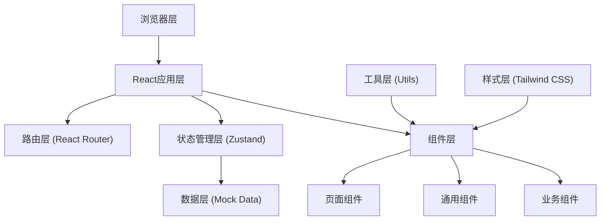
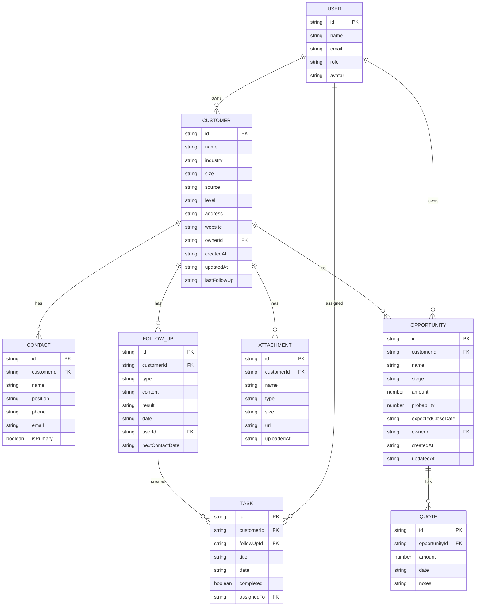

## 1. 架构设计



## 2. 技术描述

- **前端框架**：React@18 + TypeScript
- **构建工具**：Vite@5
- **路由管理**：react-router-dom@6
- **状态管理**：zustand@4
- **样式方案**：tailwindcss@3
- **图标库**：lucide-react@0.294
- **图表库**：recharts@2
- **数据持久化**：localStorage（模拟后端存储）
- **初始化模板**：react-ts（纯前端项目，使用Mock数据）

## 3. 目录结构

```
d:\code\TraeProjects\1071/
├── src/
│   ├── components/          # 通用组件
│   │   ├── Layout/         # 布局组件
│   │   ├── ui/             # 基础UI组件
│   │   └── charts/         # 图表组件
│   ├── pages/              # 页面组件
│   │   ├── CustomerList/
│   │   ├── CustomerDetail/
│   │   ├── Schedule/
│   │   ├── Opportunities/
│   │   └── Reports/
│   ├── store/              # 状态管理
│   │   └── useCRMStore.ts
│   ├── data/               # Mock数据
│   │   └── mockData.ts
│   ├── types/              # TypeScript类型定义
│   │   └── index.ts
│   ├── utils/              # 工具函数
│   │   └── helpers.ts
│   ├── App.tsx
│   ├── main.tsx
│   └── index.css
├── .trae/
│   └── documents/
├── vite.config.ts
├── tailwind.config.js
├── tsconfig.json
└── package.json
```

## 4. 路由定义

| 路由 | 页面 | 说明 |
|------|------|------|
| `/` | 客户列表页 | 默认首页，展示客户列表 |
| `/customers` | 客户列表页 | 客户搜索、筛选、新增 |
| `/customers/:id` | 客户详情页 | 客户资料、联系人、跟进记录 |
| `/schedule` | 跟进日程页 | 待办列表、日历视图 |
| `/opportunities` | 销售机会页 | 商机看板、阶段管理 |
| `/reports` | 统计报表页 | 销售漏斗、数据分析 |

## 5. 数据模型

### 5.1 数据模型定义



### 5.2 类型定义

```typescript
export interface User {
  id: string;
  name: string;
  email: string;
  role: 'sales' | 'manager';
  avatar: string;
}

export interface Contact {
  id: string;
  customerId: string;
  name: string;
  position: string;
  phone: string;
  email: string;
  isPrimary: boolean;
}

export interface FollowUp {
  id: string;
  customerId: string;
  type: 'call' | 'meeting' | 'email' | 'other';
  content: string;
  result: string;
  date: string;
  userId: string;
  nextContactDate?: string;
}

export interface Attachment {
  id: string;
  customerId: string;
  name: string;
  type: string;
  size: number;
  url: string;
  uploadedAt: string;
}

export interface Quote {
  id: string;
  opportunityId: string;
  amount: number;
  date: string;
  notes: string;
}

export interface Opportunity {
  id: string;
  customerId: string;
  name: string;
  stage: 'initial' | 'needs' | 'proposal' | 'negotiation' | 'won' | 'lost';
  amount: number;
  probability: number;
  expectedCloseDate: string;
  ownerId: string;
  createdAt: string;
  updatedAt: string;
  quotes: Quote[];
}

export interface Task {
  id: string;
  customerId: string;
  followUpId?: string;
  title: string;
  date: string;
  completed: boolean;
  assignedTo: string;
}

export interface Customer {
  id: string;
  name: string;
  industry: string;
  size: 'small' | 'medium' | 'large';
  source: string;
  level: 'A' | 'B' | 'C' | 'D';
  address: string;
  website: string;
  ownerId: string;
  createdAt: string;
  updatedAt: string;
  lastFollowUp?: string;
  contacts: Contact[];
  followUps: FollowUp[];
  attachments: Attachment[];
  opportunities: Opportunity[];
  tasks: Task[];
}
```

## 6. 状态管理设计

使用Zustand创建全局状态管理：

```typescript
interface CRMState {
  customers: Customer[];
  users: User[];
  currentUser: User;
  loading: boolean;
  
  // 客户操作
  addCustomer: (customer: Omit<Customer, 'id' | 'createdAt' | 'updatedAt'>) => void;
  updateCustomer: (id: string, data: Partial<Customer>) => void;
  deleteCustomer: (id: string) => void;
  getCustomerById: (id: string) => Customer | undefined;
  
  // 联系人操作
  addContact: (customerId: string, contact: Omit<Contact, 'id'>) => void;
  updateContact: (customerId: string, contactId: string, data: Partial<Contact>) => void;
  deleteContact: (customerId: string, contactId: string) => void;
  
  // 跟进记录操作
  addFollowUp: (customerId: string, followUp: Omit<FollowUp, 'id'>) => void;
  
  // 商机操作
  addOpportunity: (customerId: string, opportunity: Omit<Opportunity, 'id' | 'createdAt' | 'updatedAt' | 'quotes'>) => void;
  updateOpportunityStage: (id: string, stage: Opportunity['stage']) => void;
  addQuote: (opportunityId: string, quote: Omit<Quote, 'id'>) => void;
  
  // 任务操作
  addTask: (task: Omit<Task, 'id'>) => void;
  toggleTask: (id: string) => void;
  assignTask: (id: string, userId: string) => void;
  
  // 搜索筛选
  searchCustomers: (keyword: string) => Customer[];
  filterCustomers: (filters: { level?: string; source?: string; ownerId?: string }) => Customer[];
  
  // 统计
  getSalesFunnel: () => { stage: string; count: number; amount: number }[];
  getTeamPerformance: () => { userId: string; name: string; wonAmount: number; conversionRate: number }[];
}
```

## 7. 关键组件设计

| 组件名 | 路径 | 职责 |
|--------|------|------|
| `Sidebar` | `src/components/Layout/Sidebar.tsx` | 左侧导航栏，路由切换 |
| `Header` | `src/components/Layout/Header.tsx` | 顶部操作栏，搜索、用户信息 |
| `CustomerCard` | `src/components/CustomerCard.tsx` | 客户卡片组件 |
| `OpportunityCard` | `src/components/OpportunityCard.tsx` | 商机卡片组件，支持拖拽 |
| `KanbanBoard` | `src/components/KanbanBoard.tsx` | 商机看板组件 |
| `Timeline` | `src/components/Timeline.tsx` | 跟进记录时间线 |
| `SalesFunnelChart` | `src/components/charts/SalesFunnelChart.tsx` | 销售漏斗图 |
| `Modal` | `src/components/ui/Modal.tsx` | 通用弹窗 |
| `Button` | `src/components/ui/Button.tsx` | 通用按钮 |
| `Input` | `src/components/ui/Input.tsx` | 通用输入框 |
| `Select` | `src/components/ui/Select.tsx` | 通用下拉选择 |
| `Badge` | `src/components/ui/Badge.tsx` | 标签组件 |
